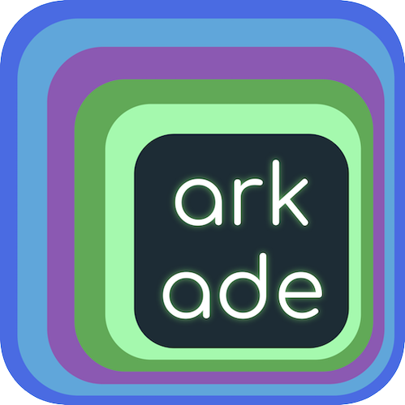

# arkade - The Open Source Marketplace For Kubernetes

arkade is how developers install the latest versions of their favourite tools and Kubernetes apps.

With `arkade get`, you'll have `kubectl`, `kind`, `terraform`, and `jq` on your machine faster than you can type `apt-get install/brew update`.



[](https://github.com/sponsors/alexellis)
[](https://github.com/alexellis/arkade/actions/workflows/build.yml)
[](https://godoc.org/github.com/alexellis/arkade)
[](https://opensource.org/licenses/MIT)


With over 90 CLIs and 55 apps (charts, manifests, installers) available for Kubernetes, gone are the days of contending with dozens of README files just to set up a development stack with the usual suspects like ingress-nginx, Postgres and cert-manager.

- [arkade - The Open Source Kubernetes Marketplace](#arkade---the-open-source-kubernetes-marketplace)
  - [Help fund arkade](#help-fund-arkade-)
  - [Should you try arkade?](#should-you-try-arkade)
  - [Getting arkade](#getting-arkade)
  - [Usage overview](#usage-overview)
  - [Download CLI tools with arkade](#download-cli-tools-with-arkade)
  - [Use arkade for GitHub Actions](#use-arkade-for-github-actions)
  - [Install System Packages](#install-system-packages)
  - [Installing apps with arkade](#installing-apps-with-arkade)
  - [Community & contributing](#community--contributing)
  - [Sponsored apps](#sponsored-apps)
  - [FAQ](#faq)


## Help fund arkade 👋

<a href="https://github.com/sponsors/alexellis/">Alex</a> made this project open source and free, so everyone can benefit from it, including you.

The project is funded through <a href="https://github.com/sponsors/alexellis/">GitHub Sponsors</a>, and you can join today.

<a href="https://github.com/sponsors/alexellis/">

</a>

Which tier or option is right for you? [Find out now](https://github.com/sponsors/alexellis/)

## Should you try arkade?

> I was setting up a new dev environment yesterday. Kind, helm, kustomize, kubectl, all this stuff. My take is - arkade is highly underappreciated.
> I'd spend an hour in the past to install such tools. With arkade it was under ten minutes.
>
> [Ivan Velichko](https://twitter.com/iximiuz/status/1422605221226860548?s=20), SRE @ Booking.com

> Before arkade whenever I used to spin up an instance, I used to go to multiple sites and download the binary. Arkade is one of my favourite tools.
> 
> [Kumar Anurag](https://kubesimplify.com/arkade) - Cloud Native Enthusiast

> It's hard to use K8s without Arkade these days.
> My team at @lftechnology absolutely loves it.
>
> [@Yankexe](https://twitter.com/yankexe/status/1305427718050250754?s=20)

> arkade is really a great tool to install CLI tools, and system packages, check this blog on how to get started with arkade it's a time saver.
> 
> [Kiran Satya Raj](https://twitter.com/jksrtwt/status/1556592117627047936?s=20&t=g0gnSP98jg3ZwU7sQqUrLw)

> This is real magic get #kubernetes up and going in a second; then launch #openfaas a free better than lambda solution that uses docker images.
>
> [Greg](https://twitter.com/cactusanddove) runs Fullstack JS and is a JavaScript developer

> for getting the basics installed, nothing beats arkade
> it can install commonly used cli tools like kubectl locally for you, as well as common k8s pkgs like ingress-nginx or portainer
>
> [@arghzero](https://twitter.com/ArghZero/status/1346097288851070983?s=20)

> I finally got around to installing Arkade, super simple!
> quicker to install this than the argocli standalone commands, but there are lots of handy little tools in there.
> also, the neat little part about arkade, not only does it make it easy to install a ton of different apps and CLIs you can also get the info on them as well pretty quickly.
> 
> [Michael Cade @ Kasten](https://twitter.com/MichaelCade1/status/1390403831167700995?s=20)

> You've to install latest and greatest tools for your daily @kubernetesio tasks? No problem, check out #arkade the open source #kubernetes marketplace 👍
>
> [Thorsten Hans](https://twitter.com/ThorstenHans/status/1457982292597608449?s=20) - Cloud Native consultant

> If you want to install quickly a new tool in your dev env or in your k8s cluster you can use the Arkade (https://github.com/alexellis/arkade) easy and quick you should try out! Ps. I contribute to this project 🥰
>
> [Carlos Panato](https://twitter.com/comedordexis/status/1423339283713347587) - Staff engineer @ Mattermost

> arkade is the 'brew install' of Kubernetes. You can install and run an application in a single command. Finally! https://github.com/alexellis/arkade / by Alex Ellis
>
> [John Arundel](https://twitter.com/bitfield/status/1242385165445455872?s=20) - Cloud consultant, author

## Getting arkade

```bash
# Note: you can also run without `sudo` and move the binary yourself
curl -sLS https://get.arkade.dev | sudo sh

arkade --help
ark --help  # a handy alias

# Windows users with Git Bash
curl -sLS https://get.arkade.dev | sh
```

> Windows users: arkade requires bash to be available, therefore Windows users should [install and use Git Bash](https://git-scm.com/downloads)

An alias of `ark` is created at installation time, so you can also run `ark install APP`

## Usage overview

Arkade can be used to install Kubernetes apps or to download CLI tools.

* `arkade install` - install a Kubernetes app
* `arkade info` - see the post installation screen for a Kubernetes app
* `arkade get` - download a CLI tool
* `arkade update` - update arkade itself

An arkade "app" could represent a helm chart such as `openfaas/faas-netes`, a custom CLI installer such as `istioctl` or a set of static manifests (i.e. MetalLB).

An arkade "tool" is a CLI that can be downloaded for your operating system. Arkade downloads statically-linked binaries from their upstream locations on GitHub or a the vendor's chosen URL such as with `kubectl` and `terraform`.

> Did you know? Arkade users run `arkade get` both on their local workstations, and on their CI runners such as GitHub Actions or Jenkins.

## Download CLI tools with arkade

arkade downloads the correct version of a CLI for your OS and CPU.

With automatic detection of: Windows / MacOS / Linux / Intel / ARM.

```bash
# Download a binary release of a tool

arkade get kubectl

# Download a specific version of that tool
arkade get kubectl@v1.22.0

# Download multiple tools at once
arkade get kubectl \
  helm \
  istioctl

# Download multiple specific versions
arkade get faas-cli@0.13.15 \
  kubectl@v1.22.0

# Override machine os/arch
arkade get faas-cli \
  --arch arm64 \
  --os linux

# Override machine os/arch
arkade get faas-cli \
  --arch arm64 \
  --os darwin
```
> This is a time saver compared to searching for download pages every time you need a tool.


Think of `arkade get TOOL` as a doing for CLIs, what `arkade install` does for helm.

Adding a new tool for download is as simple as editing [tools.go](https://github.com/alexellis/arkade/blob/master/pkg/get/tools.go).

[Click here for the full catalog of CLIs](#catalog-of-apps)

## Install System Packages

System packages are tools designed for installation on a Linux workstation, server or CI runner.

These are a more limited group of applications designed for quick setup, scripting and CI, and generally do not fit into the `arkade get` pattern, due to additional installation steps or system configuration.

```bash
# Show packages
arkade system install

# Show package flags
arkade system install go --help

# Install latest version of Go to /usr/local/bin/go
arkade system install go

# Install Go 1.18 to /tmp/go
arkade system install go \
  --version 1.18 \
  --path /tmp/

# Install containerd for ARM64, 32-bit ARM or x86_64
# with systemd enabled
arkade install system containerd \
  --systemd
```

Run the following to see what's available `arkade system install`:

```bash
  actions-runner  Install GitHub Actions Runner
  cni             Install CNI plugins
  containerd      Install containerd
  firecracker     Install Firecracker
  go              Install Go
  node            Install Node.js
  prometheus      Install Prometheus
  tc-redirect-tap Install tc-redirect-tap
```

The initial set of system apps is now complete, learn more in the original proposal: [Feature: system packages for Linux servers, CI and workstations #654](https://github.com/alexellis/arkade/issues/654)

## Use arkade for GitHub Actions

arkade works well for CI, to get system-level packages or CLIs that you need.

There are no special steps required, just install the binary and run the commands you see in this README file. However, a GitHub Action exists for arkade along with a few examples:

See also: [alexellis/setup-arkade@master](https://github.com/alexellis/setup-arkade)

## Validate Helm chart images from within a values.yaml file

The `arkade chart validate` command validates that all images specified are accessible on a remote registry and takes a values.yaml file as its input.

Successful checking of a chart with `image: ghcr.io/openfaas/cron-connector:TAG`:

```bash
arkade chart verify  -f ~/go/src/github.com/openfaas/faas-netes/chart/cron-connector/values.yaml

echo $?
0
```

There is an exit code of zero and no output when the check passed.

You can pass `--verbose` to see a detailed view of what's happening.

Checking of nested components, where two of the images do not exist `autoscaler.image` and `dashboard.image`:

```bash
arkade chart verify  -f ~/go/src/github.com/openfaas/faas-netes/chart/openfaas/values.yamlecho $?
2 images are missing in /Users/alex/go/src/github.com/openfaas/faas-netes/chart/openfaas/values.yaml

COMPONENT           IMAGE
dashboard           ghcr.io/openfaasltd/openfaas-dashboard:0.9.8
autoscaler          ghcr.io/openfaasltd/autoscaler:0.2.5

Error: verifying failed

echo $?
1
```

Supported:

* `image:` - at the top level
* `component.image:` i.e. one level of nesting

Not supported yet:
* Custom strings that don't match the word "image": `clientImage: `
* Split fields for the image and tag name i.e. `image.name` and `image.tag`
* Third-level nesting `openfaas.gateway.image`

## Installing apps with arkade

You'll need a Kubernetes cluster to arkade. Unlike cloud-based marketplaces, arkade doesn't have any special pre-requirements and can be used with any private or public cluster.

### Create a Kubernetes cluster

If you have Docker installed, then you can install Kubernetes using KinD in a matter of moments:

```bash
arkade get kubectl@v1.22.0 \
  kind@v0.11.1

kind create cluster
```

You can also download k3d [k3s](https://github.com/rancher/k3s) in the same way with `arkade get k3d`.

### Install a Kubernetes app

No need to worry about whether you're installing to Intel or ARM architecture, the correct values will be set for you automatically.

```bash
arkade install openfaas \
  --gateways 2 \
  --load-balancer false
```

The post-installation message shows you how to connect. And whenever you want to see those details again, just run `arkade info openfaas`.

There's even more options you can chose with `arkade install openfaas --help` - the various flags you see map to settings from the helm chart README, that you'd usually have to look up and set via a `values.yaml` file.

If there's something missing from the list of flags that you need, arkade also supports `--set` for any arkade app that uses helm. Note that not every app uses helm.

Remember how awkward it was last time you installed the [Kubernetes dashboard](https://github.com/kubernetes/dashboard)? And how you could never remember the command to get the token to log in?

```bash
arkade install kubernetes-dashboard
```

Forgot your token? `arkade info kubernetes-dashboard`

This is an example of an arkade app that uses static YAML manifests instead of helm.

Prefer [Portainer](https://www.portainer.io)? Just run: `arkade install portainer`

### Uninstall an app

Run `arkade uninstall` or `arkade delete` for more information on how to remove applications from a Kubernetes cluster.

### Reduce the repetition

[Normally up to a dozen commands](https://cert-manager.io/docs/installation/kubernetes/) (including finding and downloading helm), now just one. No searching for the correct CRD to apply, no trying to install helm, no trying to find the correct helm repo to add:

```bash
arkade install cert-manager
```

Other common tools:

```bash
arkade install ingress-nginx

arkade install metrics-server
```

### Say goodbye to values.yaml and hello to flags

We use strongly typed Go CLI flags, so that you can run `--help` instead of trawling through countless Helm chart README files to find the correct `--set` combination for what you want.

```bash
arkade install ingress-nginx --help

Install ingress-nginx. This app can be installed with Host networking for
cases where an external LB is not available. please see the --host-mode
flag and the ingress-nginx docs for more info

Usage:
  arkade install ingress-nginx [flags]

Aliases:
  ingress-nginx, nginx-ingress

Examples:
  arkade install ingress-nginx --namespace default

Flags:
  -h, --help               help for ingress-nginx
      --host-mode          If we should install ingress-nginx in host mode.
  -n, --namespace string   The namespace used for installation (default "default")
      --update-repo        Update the helm repo (default true)
```

### Override with `--set`

You can also set helm overrides, for apps which use helm via `--set`

```bash
ark install openfaas --set faasIdler.dryRun=false
```

After installation, an info message will be printed with help for usage, you can get back to this at any time via:

```bash
arkade info <NAME>
```

### Compounding apps

Apps are easier to discover and install than helm chart which involve many more manual steps, however when you compound apps together, they really save you time.

#### Get a self-hosted TLS registry with authentication

Here's how you can get a self-hosted Docker registry with TLS and authentication in just 5 commands on an empty cluster:

Here's how you would bootstrap OpenFaaS with TLS:

```bash
arkade install ingress-nginx
arkade install cert-manager
arkade install openfaas
arkade install openfaas-ingress \
  --email web@example.com \
  --domain openfaas.example.com
```

And here's what it looks like for a private Docker registry with authentication enabled:

```bash
arkade install ingress-nginx
arkade install cert-manager
arkade install docker-registry
arkade install docker-registry-ingress \
  --email web@example.com \
  --domain reg.example.com
```

#### Get a public IP for a private cluster and your IngressController

And if you're running on a private cloud, on-premises or on your laptop, you can simply add the [inlets-operator](https://github.com/inlets/inlets-operator/) using [inlets](https://docs.inlets.dev/) to get a secure TCP tunnel and a public IP address.

```bash
arkade install inlets-operator \
  --access-token $HOME/digitalocean-token \
  --region lon1 \
  --provider digitalocean
```

This makes your cluster behave like it was on a public cloud and LoadBalancer IPs go from Pending to a real, functioning IP.

### Explore the apps

You can view the various apps available with `arkade install / --help`, more are available when you run the command yourself.

```bash
arkade install --help
ark --help

Examples:
  arkade install
  arkade install openfaas --helm3 --gateways=2
  arkade install inlets-operator --token-file $HOME/do-token
```

See the full catalog of apps: [See all apps](#catalog-of-apps)

## Community & contributing

### Tutorials & community blog posts

#### Watch a video walk-through by Alex Ellis

[](https://www.youtube.com/watch?v=8wU9s_mua8M)

#### Featured tutorials

* [arkade by example — Kubernetes apps, the easy way 😎](https://medium.com/@alexellisuk/kubernetes-apps-the-easy-way-f06d9e5cad3c) - Alex Ellis
* [Walk-through — install Kubernetes to your Raspberry Pi in 15 minutes](https://medium.com/@alexellisuk/walk-through-install-kubernetes-to-your-raspberry-pi-in-15-minutes-84a8492dc95a)
* [Get a TLS-enabled Docker registry in 5 minutes](https://blog.alexellis.io/get-a-tls-enabled-docker-registry-in-5-minutes/) - Alex Ellis
* [Get TLS for OpenFaaS the easy way with arkade](https://blog.alexellis.io/tls-the-easy-way-with-openfaas-and-k3sup/) - Alex Ellis

#### Official blog posts

* [Two year update: Building an Open Source Marketplace for Kubernetes](https://blog.alexellis.io/kubernetes-marketplace-two-year-update/)
* [Why did the OpenFaaS community build arkade and what's in it for you?](https://www.openfaas.com/blog/openfaas-arkade/) - Alex Ellis

#### Community posts

* [A bit of Istio before tea-time](https://blog.alexellis.io/a-bit-of-istio-before-tea-time/) - Alex Ellis
* [Kubernetes: Automatic Let's Encrypt Certificates for Services with arkade](https://medium.com/@admantium/kubernetes-automatic-lets-encrypt-certificates-for-services-2a5f4aa7f886)
* [Introducing Arkade - The Kubernetes app installer](https://blog.heyal.co.uk/introducing-arkade/) - Alistair Hey
* [Portainer for kubernetes in less than 60 seconds!!](https://www.portainer.io/2020/04/portainer-for-kubernetes-in-less-than-60-seconds/) - by Saiyam Pathak
* [Video walk-through with DJ Adams - Pi & Kubernetes with k3s, k3sup, arkade and OpenFaaS](https://www.youtube.com/watch?v=ZiR3QEfBivk)
* [Coffee chat: Easy way to install Kubernetes Apps - arkade (ark)](https://sachcode.com/tech/coffee-chat-easy-way-install-kubernetes-apps/) by Sachin Jha
* [Arkade & OpenFaaS: serverless on the spot](https://zero2datadog.readthedocs.io/en/latest/faas.html) by Blaise Pabon
* ["Tool of the Day" with Adrian Goins from Rancher Labs](https://youtu.be/IWtEtfpqoRg?t=1425)

### Suggest a new app

To suggest a new app, please check past issues and [raise an issue for it](https://github.com/alexellis/arkade). Think also whether your app suggestion would be a good candidate for a Sponsored App.

## Sponsored apps

You can now propose your project or product as a Sponsored App. Sponsored Apps work just like any other app that we've curated, however they will have a note next to them in the app description `(sponsored)` and a link to your chosen site upon installation. An app sponsorship can be purchased for a minimum of 12 months and includes free development of the Sponsored App, with ongoing support via GitHub for the Sponsored App for the duration only. Ongoing support will be limited to a set amount of hours per month.

When your sponsorship expires the Sponsored App will be removed from arkade, and the ongoing support will cease. A Sponsored App can be renewed 60 days prior to expiration subject to a separate agreement and payment.

Example:

```bash
arkade VENDOR install PRODUCT
arkade acmeco install dashboard
```

[Contact OpenFaas Ltd](mailto:contact@openfaas.com) to find out how you can have your Sponsored App added to arkade.

## FAQ

### How does `arkade` compare to `helm`?

In the same way that [brew](https://brew.sh) uses git and Makefiles to compile applications for your Mac, `arkade` uses upstream [helm](https://helm.sh) charts and `kubectl` to install applications to your Kubernetes cluster. arkade exposes strongly-typed flags for the various popular options for helm charts, and enables easier discovery through `arkade install --help` and `arkade install APP --help`.

### Is arkade suitable for production use?

If you consider helm suitable, and `kubectl` then yes, arkade by definition uses those tools and the upstream artifacts of OSS projects.

Do you want to run arkade in a CI or CD pipeline? Go ahead.

### What is in scope for `arkade get`?

Generally speaking, tools that are used with the various arkade apps or with Kubernetes are in scope. If you want to propose a tool, raise a GitHub issue.

What about package management? `arkade get` provides a faster alternative to package managers like `apt` and `brew`, you're free to use either or both at the same time.

### Automatic download of tools

When required, tools, CLIs, and the helm binaries are downloaded and extracted to `$HOME/.arkade`.

If installing a tool which uses helm3, arkade will check for a cached version and use that, otherwise it will download it on demand.

Did you accidentally run arkade as root? **Running as root is not required**, and will mean your KUBECONFIG environment variable will be ignored. You can revert this using [the notes on release 0.1.18](https://github.com/alexellis/arkade/releases/tag/0.1.8).

### Improving the code or fixing an issue

Before contributing code, please see the [CONTRIBUTING guide](https://github.com/alexellis/arkade/blob/master/CONTRIBUTING.md). Note that arkade uses the same guide as [inlets.dev](https://inlets.dev/).

Both Issues and PRs have their own templates. Please fill out the whole template.

All commits must be signed-off as part of the [Developer Certificate of Origin (DCO)](https://developercertificate.org)

### Join us on Slack

Join `#contributors` at [slack.openfaas.io](https://slack.openfaas.io)

### License

MIT

## Catalog of apps and CLIs

An app is software or an add-on for your Kubernetes cluster.

A CLI or "tool" is a command line tool that you run directly on your own workstation or a CI runner.

### Catalog of Apps

|          TOOL           |                             DESCRIPTION                             |
|-------------------------|---------------------------------------------------------------------|
| docker-registry-ingress | Install registry ingress with TLS                                   |
| inlets-operator         | Install inlets-operator                                             |
| kuma                    | Install Kuma                                                        |
| kube-state-metrics      | Install kube-state-metrics                                          |
| cert-manager            | Install cert-manager                                                |
| docker-registry         | Install a Docker registry                                           |
| rabbitmq                | Install rabbitmq                                                    |
| linkerd                 | Install linkerd                                                     |
| redis                   | Install redis                                                       |
| gitlab                  | Install GitLab                                                      |
| falco                   | Install Falco                                                       |
| registry-creds          | Install registry-creds                                              |
| qemu-static             | Install qemu-user-static                                            |
| metrics-server          | Install metrics-server                                              |
| postgresql              | Install postgresql                                                  |
| ingress-nginx           | Install ingress-nginx                                               |
| jenkins                 | Install jenkins                                                     |
| nginx-inc               | Install nginx-inc for OpenFaaS                                      |
| metallb-arp             | Install MetalLB in L2 (ARP) mode                                    |
| loki                    | Install Loki for monitoring and tracing                             |
| nfs-provisioner         | Install nfs subdir external provisioner                             |
| mqtt-connector          | Install mqtt-connector for OpenFaaS                                 |
| kanister                | Install kanister for application-level data management              |
| openfaas-ingress        | Install openfaas ingress with TLS                                   |
| chart                   | Install the specified helm chart                                    |
| cron-connector          | Install cron-connector for OpenFaaS                                 |
| minio                   | Install minio                                                       |
| openfaas                | Install openfaas                                                    |
| kafka                   | Install Confluent Platform Kafka                                    |
| kubernetes-dashboard    | Install kubernetes-dashboard                                        |
| OSM                     | Install osm                                                         |
| inlets-tcp-client       | Install inlets PRO TCP client                                       |
| kong-ingress            | Install kong-ingress for OpenFaaS                                   |
| sealed-secret           | Install sealed-secrets                                              |
| cassandra               | Install cassandra                                                   |
| waypoint                | Install Waypoint                                                    |
| opa-gatekeeper          | Install Open Policy Agent (OPA) Gatekeeper                          |
| mongodb                 | Install mongodb                                                     |
| grafana                 | Install grafana                                                     |
| kube-image-prefetch     | Install kube-image-prefetch                                         |
| consul-connect          | Install Consul Service Mesh                                         |
| argocd                  | Install argocd                                                      |
| prometheus              | Install Prometheus for monitoring                                   |
| istio                   | Install istio                                                       |
| crossplane              | Install Crossplane                                                  |
| cockroachdb             | Install CockroachDB                                                 |
| openfaas-loki           | Install Loki-OpenFaaS and Configure Loki logs provider for OpenFaaS |
| portainer               | Install portainer to visualise and manage containers                |
| tekton                  | Install Tekton pipelines and dashboard                              |
| traefik2                | Install traefik2                                                    |
| kafka-connector         | Install kafka-connector for OpenFaaS                                |
| gitea                   | Install gitea                                                       |
| influxdb                | Install influxdb                                                    |
| nats-connector          | Install OpenFaaS connector for NATS                                 |
| kyverno                 | Install Kyverno                                                     |
| vault                   | Install Vault                                                       |

There are 56 apps that you can install on your cluster.

> Note to contributors, run `arkade install --print-table` to generate this list

### Catalog of CLIs

|       TOOL       |                                                                DESCRIPTION                                                                |
|------------------|-------------------------------------------------------------------------------------------------------------------------------------------|
| argocd           | Declarative, GitOps continuous delivery tool for Kubernetes.                                                                              |
| argocd-autopilot | An opinionated way of installing Argo-CD and managing GitOps repositories.                                                                |
| arkade           | Portable marketplace for downloading your favourite devops CLIs and installing helm charts, with a single command.                        |
| autok3s          | Run Rancher Lab's lightweight Kubernetes distribution k3s everywhere.                                                                     |
| buildx           | Docker CLI plugin for extended build capabilities with BuildKit.                                                                          |
| bun              | Bun is an incredibly fast JavaScript runtime, bundler, transpiler and package manager – all in one.                                       |
| butane           | Translates human readable Butane Configs into machine readable Ignition Configs                                                           |
| caddy            | Caddy is an extensible server platform that uses TLS by default                                                                           |
| cilium           | CLI to install, manage & troubleshoot Kubernetes clusters running Cilium.                                                                 |
| civo             | CLI for interacting with your Civo resources.                                                                                             |
| clusterctl       | The clusterctl CLI tool handles the lifecycle of a Cluster API management cluster                                                         |
| conftest         | Write tests against structured configuration data using the Open Policy Agent Rego query language                                         |
| cosign           | Container Signing, Verification and Storage in an OCI registry.                                                                           |
| cr               | Hosting Helm Charts via GitHub Pages and Releases                                                                                         |
| crane            | crane is a tool for interacting with remote images and registries                                                                         |
| dagger           | A portable devkit for CI/CD pipelines.                                                                                                    |
| devspace         | Automate your deployment workflow with DevSpace and develop software directly inside Kubernetes.                                          |
| dive             | A tool for exploring each layer in a docker image                                                                                         |
| docker-compose   | Define and run multi-container applications with Docker.                                                                                  |
| doctl            | Official command line interface for the DigitalOcean API.                                                                                 |
| eksctl           | Amazon EKS Kubernetes cluster management                                                                                                  |
| faas-cli         | Official CLI for OpenFaaS.                                                                                                                |
| firectl          | Command-line tool that lets you run arbitrary Firecracker MicroVMs                                                                        |
| flux             | Continuous Delivery solution for Kubernetes powered by GitOps Toolkit.                                                                    |
| flyctl           | Command line tools for fly.io services                                                                                                    |
| fzf              | General-purpose command-line fuzzy finder                                                                                                 |
| gh               | GitHub’s official command line tool.                                                                                                      |
| golangci-lint    | Go linters aggregator.                                                                                                                    |
| gomplate         | A flexible commandline tool for template rendering. Supports lots of local and remote datasources.                                        |
| goreleaser       | Deliver Go binaries as fast and easily as possible                                                                                        |
| hadolint         | A smarter Dockerfile linter that helps you build best practice Docker images                                                              |
| helm             | The Kubernetes Package Manager: Think of it like apt/yum/homebrew for Kubernetes.                                                         |
| helmfile         | Deploy Kubernetes Helm Charts                                                                                                             |
| hey              | Load testing tool                                                                                                                         |
| hostctl          | Dev tool to manage /etc/hosts like a pro!                                                                                                 |
| hubble           | CLI for network, service & security observability for Kubernetes clusters running Cilium.                                                 |
| hugo             | Static HTML and CSS website generator.                                                                                                    |
| influx           | InfluxDB’s command line interface (influx) is an interactive shell for the HTTP API.                                                      |
| inlets-pro       | Cloud Native Tunnel for HTTP and TCP traffic.                                                                                             |
| inletsctl        | Automates the task of creating an exit-server (tunnel server) on public cloud infrastructure.                                             |
| istioctl         | Service Mesh to establish a programmable, application-aware network using the Envoy service proxy.                                        |
| jq               | jq is a lightweight and flexible command-line JSON processor                                                                              |
| just             | Just a command runner                                                                                                                     |
| k0s              | Zero Friction Kubernetes                                                                                                                  |
| k0sctl           | A bootstrapping and management tool for k0s clusters                                                                                      |
| k10multicluster  | Multi-cluster support for K10.                                                                                                            |
| k10tools         | Tools for evaluating and debugging K10.                                                                                                   |
| k3d              | Helper to run Rancher Lab's k3s in Docker.                                                                                                |
| k3s              | Lightweight Kubernetes                                                                                                                    |
| k3sup            | Bootstrap Kubernetes with k3s over SSH < 1 min.                                                                                           |
| k9s              | Provides a terminal UI to interact with your Kubernetes clusters.                                                                         |
| kail             | Kubernetes log viewer.                                                                                                                    |
| kanctl           | Framework for application-level data management on Kubernetes.                                                                            |
| kgctl            | A CLI to manage Kilo, a multi-cloud network overlay built on WireGuard and designed for Kubernetes.                                       |
| kim              | Build container images inside of Kubernetes. (Experimental)                                                                               |
| kind             | Run local Kubernetes clusters using Docker container nodes.                                                                               |
| kops             | Production Grade K8s Installation, Upgrades, and Management.                                                                              |
| krew             | Package manager for kubectl plugins.                                                                                                      |
| kube-bench       | Checks whether Kubernetes is deployed securely by running the checks documented in the CIS Kubernetes Benchmark.                          |
| kubebuilder      | Framework for building Kubernetes APIs using custom resource definitions (CRDs).                                                          |
| kubecm           | Easier management of kubeconfig.                                                                                                          |
| kubeconform      | A FAST Kubernetes manifests validator, with support for Custom Resources                                                                  |
| kubectl          | Run commands against Kubernetes clusters                                                                                                  |
| kubectx          | Faster way to switch between clusters.                                                                                                    |
| kubens           | Switch between Kubernetes namespaces smoothly.                                                                                            |
| kubescape        | kubescape is the first tool for testing if Kubernetes is deployed securely as defined in Kubernetes Hardening Guidance by to NSA and CISA |
| kubeseal         | A Kubernetes controller and tool for one-way encrypted Secrets                                                                            |
| kubestr          | Kubestr discovers, validates and evaluates your Kubernetes storage options.                                                               |
| kubetail         | Bash script to tail Kubernetes logs from multiple pods at the same time.                                                                  |
| kubeval          | Validate your Kubernetes configuration files, supports multiple Kubernetes versions                                                       |
| kumactl          | kumactl is a CLI to interact with Kuma and its data                                                                                       |
| kustomize        | Customization of kubernetes YAML configurations                                                                                           |
| lazygit          | A simple terminal UI for git commands.                                                                                                    |
| linkerd2         | Ultralight, security-first service mesh for Kubernetes.                                                                                   |
| mc               | MinIO Client is a replacement for ls, cp, mkdir, diff and rsync commands for filesystems and object storage.                              |
| metal            | Official Equinix Metal CLI                                                                                                                |
| minikube         | Runs the latest stable release of Kubernetes, with support for standard Kubernetes features.                                              |
| mixctl           | A tiny TCP load-balancer.                                                                                                                 |
| mkcert           | A simple zero-config tool to make locally trusted development certificates with any names you'd like.                                     |
| nats             | Utility to interact with and manage NATS.                                                                                                 |
| nats-server      | Cloud native message bus and queue server                                                                                                 |
| nerdctl          | Docker-compatible CLI for containerd, with support for Compose                                                                            |
| nova             | Find outdated or deprecated Helm charts running in your cluster.                                                                          |
| oh-my-posh       | A prompt theme engine for any shell that can display kubernetes information.                                                              |
| opa              | General-purpose policy engine that enables unified, context-aware policy enforcement across the entire stack.                             |
| operator-sdk     | Operator SDK is a tool for scaffolding and generating code for building Kubernetes operators                                              |
| osm              | Open Service Mesh uniformly manages, secures, and gets out-of-the-box observability features.                                             |
| pack             | Build apps using Cloud Native Buildpacks.                                                                                                 |
| packer           | Build identical machine images for multiple platforms from a single source configuration.                                                 |
| polaris          | Run checks to ensure Kubernetes pods and controllers are configured using best practices.                                                 |
| popeye           | Scans live Kubernetes cluster and reports potential issues with deployed resources and configurations.                                    |
| porter           | With Porter you can package your application artifact, tools, etc. as a bundle that can distribute and install.                           |
| promtool         | Prometheus rule tester and debugging utility                                                                                              |
| rekor-cli        | Secure Supply Chain - Transparency Log                                                                                                    |
| rpk              | Kafka compatible streaming platform for mission critical workloads.                                                                       |
| run-job          | Run a Kubernetes Job and get the logs when it's done.                                                                                     |
| sops             | Simple and flexible tool for managing secrets                                                                                             |
| stern            | Multi pod and container log tailing for Kubernetes.                                                                                       |
| talosctl         | The command-line tool for managing Talos Linux OS.                                                                                        |
| tctl             | Temporal CLI.                                                                                                                             |
| terraform        | Infrastructure as Code for major cloud providers.                                                                                         |
| terragrunt       | Terragrunt is a thin wrapper for Terraform that provides extra tools for working with multiple Terraform modules                          |
| terrascan        | Detect compliance and security violations across Infrastructure as Code.                                                                  |
| tfsec            | Security scanner for your Terraform code                                                                                                  |
| tilt             | A multi-service dev environment for teams on Kubernetes.                                                                                  |
| tkn              | A CLI for interacting with Tekton.                                                                                                        |
| trivy            | Vulnerability Scanner for Containers and other Artifacts, Suitable for CI.                                                                |
| vagrant          | Tool for building and distributing development environments.                                                                              |
| vault            | A tool for secrets management, encryption as a service, and privileged access management.                                                 |
| vcluster         | Create fully functional virtual Kubernetes clusters - Each vcluster runs inside a namespace of the underlying k8s cluster.                |
| viddy            | A modern watch command. Time machine and pager etc.                                                                                       |
| waypoint         | Easy application deployment for Kubernetes and Amazon ECS                                                                                 |
| yq               | Portable command-line YAML processor.                                                                                                     |
There are 113 tools, use `arkade get NAME` to download one.


> Note to contributors, run `arkade get --output markdown` to generate this list
